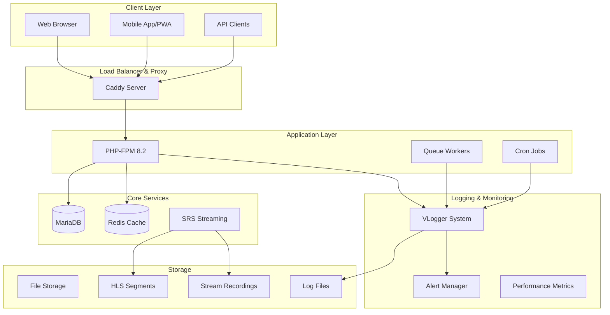

# Design Document - Enhanced with Comprehensive Logging

## Overview

The EasyStream platform design builds upon the existing PHP-based architecture to create a complete, production-ready video streaming platform. The system follows a modular MVC-like pattern with clear separation between core framework components, business logic modules, and presentation layers. **A key focus is on comprehensive logging that enables rapid error identification and resolution without extensive debugging.**

## Architecture

### High-Level Architecture



## Comprehensive Logging System Design

### 1. Multi-Level Logging Architecture

```php
// Enhanced VLogger with comprehensive context tracking
class VLogger {
    const EMERGENCY = 0;  // System is unusable
    const ALERT     = 1;  // Action must be taken immediately
    const CRITICAL  = 2;  // Critical conditions
    const ERROR     = 3;  // Error conditions
    const WARNING   = 4;  // Warning conditions
    const NOTICE    = 5;  // Normal but significant condition
    const INFO      = 6;  // Informational messages
    const DEBUG     = 7;  // Debug-level messages
    
    private $contextData = [];
    
    public function __construct() {
        $this->initializeContext();
    }
    
    private function initializeContext() {
        $this->contextData = [
            'request_id' => $this->generateRequestId(),
            'session_id' => session_id(),
            'user_id' => $_SESSION['user_id'] ?? null,
            'ip_address' => $this->getRealIpAddress(),
            'user_agent' => $_SERVER['HTTP_USER_AGENT'] ?? null,
            'request_uri' => $_SERVER['REQUEST_URI'] ?? null,
            'request_method' => $_SERVER['REQUEST_METHOD'] ?? null,
            'timestamp' => microtime(true),
            'memory_usage' => memory_get_usage(true),
            'peak_memory' => memory_get_peak_usage(true)
        ];
    }
    
    public function logWithFullContext($level, $message, $additionalContext = []) {
        $logEntry = [
            'level' => $this->getLevelName($level),
            'message' => $message,
            'context' => array_merge($this->contextData, $additionalContext),
            'backtrace' => $this->getCleanBacktrace(),
            'server_info' => $this->getServerInfo(),
            'performance' => $this->getPerformanceMetrics()
        ];
        
        // Write to multiple destinations
        $this->writeToFile($logEntry);
        $this->writeToDatabase($logEntry);
        $this->sendToMonitoring($logEntry);
        
        // Send alerts for critical issues
        if ($level <= self::ERROR) {
            $this->sendAlert($logEntry);
        }
    }
}
```

### 2. Specialized Logging Categories

#### Database Operation Logging
```php
class VDatabase {
    private $logger;
    
    public function executeQuery($sql, $params = []) {
        $startTime = microtime(true);
        $queryId = uniqid('query_');
        
        $this->logger->logDatabaseOperation('query_start', [
            'query_id' => $queryId,
            'sql' => $sql,
            'params' => $this->sanitizeParams($params),
            'caller' => $this->getCaller()
        ]);
        
        try {
            $result = $this->db->Execute($sql, $params);
            $executionTime = microtime(true) - $startTime;
            
            $this->logger->logDatabaseOperation('query_success', [
                'query_id' => $queryId,
                'execution_time' => $executionTime,
                'rows_affected' => $result ? $result->RecordCount() : 0,
                'memory_after' => memory_get_usage(true)
            ]);
            
            // Alert on slow queries
            if ($executionTime > 1.0) {
                $this->logger->logPerformanceIssue('slow_query', [
                    'query_id' => $queryId,
                    'execution_time' => $executionTime,
                    'sql' => $sql
                ]);
            }
            
            return $result;
            
        } catch (Exception $e) {
            $this->logger->logDatabaseError('query_failed', [
                'query_id' => $queryId,
                'error' => $e->getMessage(),
                'error_code' => $e->getCode(),
                'sql' => $sql,
                'params' => $this->sanitizeParams($params),
                'execution_time' => microtime(true) - $startTime
            ]);
            throw $e;
        }
    }
}
```

#### File Upload and Processing Logging
```php
class VContent {
    public function uploadFile($file) {
        $uploadId = uniqid('upload_');
        
        $this->logger->logFileOperation('upload_start', [
            'upload_id' => $uploadId,
            'filename' => $file['name'],
            'size' => $file['size'],
            'type' => $file['type'],
            'tmp_name' => $file['tmp_name'],
            'user_id' => $_SESSION['user_id']
        ]);
        
        // Validate file
        $validation = $this->validateFile($file);
        if (!$validation['valid']) {
            $this->logger->logSecurityEvent('file_validation_failed', [
                'upload_id' => $uploadId,
                'filename' => $file['name'],
                'validation_errors' => $validation['errors'],
                'potential_threat' => $validation['threat_level']
            ]);
            return false;
        }
        
        // Process upload
        try {
            $result = $this->processUpload($file, $uploadId);
            
            $this->logger->logFileOperation('upload_success', [
                'upload_id' => $uploadId,
                'final_path' => $result['path'],
                'processing_time' => $result['processing_time'],
                'file_id' => $result['file_id']
            ]);
            
            return $result;
            
        } catch (Exception $e) {
            $this->logger->logFileError('upload_failed', [
                'upload_id' => $uploadId,
                'error' => $e->getMessage(),
                'trace' => $e->getTraceAsString(),
                'file_info' => $file
            ]);
            throw $e;
        }
    }
}
```

#### Security Event Logging
```php
class VSecurity {
    public function validateCSRFToken($action, $token) {
        $validationId = uniqid('csrf_');
        
        $this->logger->logSecurityEvent('csrf_validation_attempt', [
            'validation_id' => $validationId,
            'action' => $action,
            'token_provided' => substr($token, 0, 8) . '...',
            'session_id' => session_id(),
            'referer' => $_SERVER['HTTP_REFERER'] ?? null
        ]);
        
        $isValid = $this->performCSRFValidation($action, $token);
        
        if (!$isValid) {
            $this->logger->logSecurityThreat('csrf_validation_failed', [
                'validation_id' => $validationId,
                'action' => $action,
                'ip_address' => $this->getRealIpAddress(),
                'user_agent' => $_SERVER['HTTP_USER_AGENT'],
                'potential_attack' => true,
                'risk_level' => 'HIGH'
            ]);
            
            // Increment security violation counter
            $this->incrementSecurityViolations();
        }
        
        return $isValid;
    }
    
    public function checkRateLimit($key, $maxAttempts, $windowSeconds) {
        $attempts = $this->getCurrentAttempts($key, $windowSeconds);
        
        $this->logger->logSecurityEvent('rate_limit_check', [
            'key' => $key,
            'current_attempts' => $attempts,
            'max_attempts' => $maxAttempts,
            'window_seconds' => $windowSeconds,
            'ip_address' => $this->getRealIpAddress()
        ]);
        
        if ($attempts >= $maxAttempts) {
            $this->logger->logSecurityThreat('rate_limit_exceeded', [
                'key' => $key,
                'attempts' => $attempts,
                'max_attempts' => $maxAttempts,
                'ip_address' => $this->getRealIpAddress(),
                'action_taken' => 'REQUEST_BLOCKED'
            ]);
            return false;
        }
        
        return true;
    }
}
```

### 3. Performance Monitoring and Metrics

```php
class VPerformanceMonitor {
    private $metrics = [];
    private $startTime;
    
    public function startRequest() {
        $this->startTime = microtime(true);
        $this->metrics = [
            'start_memory' => memory_get_usage(true),
            'start_time' => $this->startTime,
            'db_queries' => 0,
            'cache_hits' => 0,
            'cache_misses' => 0,
            'file_operations' => 0
        ];
    }
    
    public function endRequest() {
        $endTime = microtime(true);
        $totalTime = $endTime - $this->startTime;
        
        $this->metrics['end_time'] = $endTime;
        $this->metrics['total_time'] = $totalTime;
        $this->metrics['end_memory'] = memory_get_usage(true);
        $this->metrics['peak_memory'] = memory_get_peak_usage(true);
        $this->metrics['memory_used'] = $this->metrics['end_memory'] - $this->metrics['start_memory'];
        
        $this->logger->logPerformanceMetrics('request_completed', $this->metrics);
        
        // Alert on performance issues
        if ($totalTime > 5.0) {
            $this->logger->logPerformanceIssue('slow_request', [
                'total_time' => $totalTime,
                'memory_used' => $this->metrics['memory_used'],
                'db_queries' => $this->metrics['db_queries'],
                'uri' => $_SERVER['REQUEST_URI']
            ]);
        }
    }
}
```

### 4. Streaming and Video Processing Logging

```php
class VStreaming {
    public function startStream($streamKey) {
        $streamId = uniqid('stream_');
        
        $this->logger->logStreamingEvent('stream_start_attempt', [
            'stream_id' => $streamId,
            'stream_key' => substr($streamKey, 0, 8) . '...',
            'user_id' => $_SESSION['user_id'],
            'rtmp_server' => $this->getRTMPServerInfo(),
            'expected_hls_path' => $this->getHLSPath($streamKey)
        ]);
        
        try {
            $result = $this->initializeStream($streamKey);
            
            $this->logger->logStreamingEvent('stream_started', [
                'stream_id' => $streamId,
                'stream_key' => substr($streamKey, 0, 8) . '...',
                'hls_playlist' => $result['hls_playlist'],
                'rtmp_url' => $result['rtmp_url'],
                'initialization_time' => $result['init_time']
            ]);
            
            return $result;
            
        } catch (Exception $e) {
            $this->logger->logStreamingError('stream_start_failed', [
                'stream_id' => $streamId,
                'error' => $e->getMessage(),
                'srs_status' => $this->getSRSStatus(),
                'disk_space' => $this->getDiskSpace(),
                'system_load' => sys_getloadavg()
            ]);
            throw $e;
        }
    }
    
    public function processVideo($videoId) {
        $processingId = uniqid('process_');
        
        $this->logger->logVideoProcessing('processing_start', [
            'processing_id' => $processingId,
            'video_id' => $videoId,
            'input_file' => $this->getVideoPath($videoId),
            'target_formats' => $this->getTargetFormats(),
            'ffmpeg_version' => $this->getFFmpegVersion()
        ]);
        
        $startTime = microtime(true);
        
        try {
            $result = $this->executeVideoProcessing($videoId);
            $processingTime = microtime(true) - $startTime;
            
            $this->logger->logVideoProcessing('processing_completed', [
                'processing_id' => $processingId,
                'video_id' => $videoId,
                'processing_time' => $processingTime,
                'output_files' => $result['output_files'],
                'file_sizes' => $result['file_sizes'],
                'quality_levels' => $result['quality_levels']
            ]);
            
            return $result;
            
        } catch (Exception $e) {
            $this->logger->logVideoProcessingError('processing_failed', [
                'processing_id' => $processingId,
                'video_id' => $videoId,
                'error' => $e->getMessage(),
                'ffmpeg_output' => $this->getLastFFmpegOutput(),
                'system_resources' => $this->getSystemResources(),
                'processing_time' => microtime(true) - $startTime
            ]);
            throw $e;
        }
    }
}
```

### 5. Log Analysis and Alerting System

```php
class VLogAnalyzer {
    public function analyzeErrorPatterns() {
        // Analyze recent errors for patterns
        $recentErrors = $this->getRecentErrors(3600); // Last hour
        
        $patterns = [
            'database_connection_failures' => 0,
            'file_upload_failures' => 0,
            'security_violations' => 0,
            'performance_issues' => 0,
            'streaming_failures' => 0
        ];
        
        foreach ($recentErrors as $error) {
            $this->categorizeError($error, $patterns);
        }
        
        // Send alerts if thresholds exceeded
        foreach ($patterns as $pattern => $count) {
            if ($count > $this->getThreshold($pattern)) {
                $this->sendPatternAlert($pattern, $count, $recentErrors);
            }
        }
    }
    
    public function generateDiagnosticReport($errorId) {
        $error = $this->getErrorById($errorId);
        
        return [
            'error_details' => $error,
            'related_events' => $this->getRelatedEvents($error),
            'system_state' => $this->getSystemStateAtTime($error['timestamp']),
            'user_actions' => $this->getUserActionsBeforeError($error),
            'similar_errors' => $this->findSimilarErrors($error),
            'suggested_fixes' => $this->getSuggestedFixes($error),
            'impact_assessment' => $this->assessErrorImpact($error)
        ];
    }
}
```

### 6. Real-time Log Monitoring Dashboard

```php
class VLogDashboard {
    public function getRealtimeMetrics() {
        return [
            'current_errors' => $this->getCurrentErrorCount(),
            'performance_metrics' => $this->getCurrentPerformanceMetrics(),
            'security_events' => $this->getRecentSecurityEvents(),
            'system_health' => $this->getSystemHealthStatus(),
            'active_streams' => $this->getActiveStreamCount(),
            'processing_queue' => $this->getProcessingQueueStatus(),
            'error_trends' => $this->getErrorTrends(),
            'top_errors' => $this->getTopErrors()
        ];
    }
    
    public function getErrorDetails($errorId) {
        $error = $this->getErrorById($errorId);
        
        return [
            'error' => $error,
            'context' => $this->getFullContext($error),
            'timeline' => $this->getErrorTimeline($error),
            'affected_users' => $this->getAffectedUsers($error),
            'resolution_steps' => $this->getResolutionSteps($error),
            'prevention_measures' => $this->getPreventionMeasures($error)
        ];
    }
}
```

This comprehensive logging system provides:

- **Immediate Error Identification**: Every operation is logged with full context
- **Performance Monitoring**: Real-time performance metrics and alerts
- **Security Tracking**: Complete audit trail of security events
- **Diagnostic Information**: Rich context for quick problem resolution
- **Pattern Recognition**: Automated analysis of error patterns
- **Proactive Alerting**: Immediate notifications for critical issues
- **Historical Analysis**: Trend analysis and prevention insights

**Does this enhanced design with comprehensive logging meet your expectations for quickly identifying and resolving issues?**